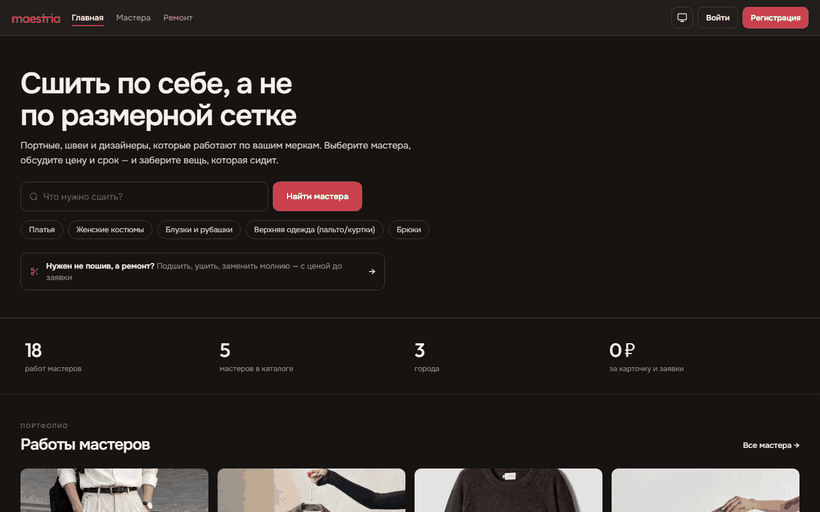
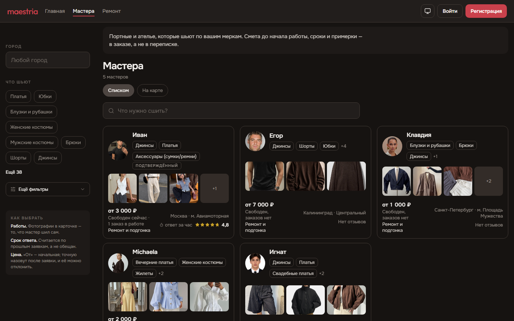
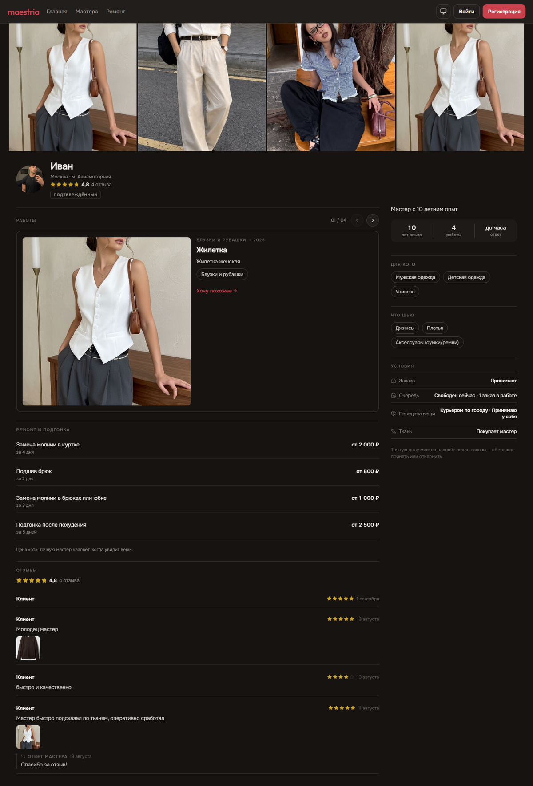
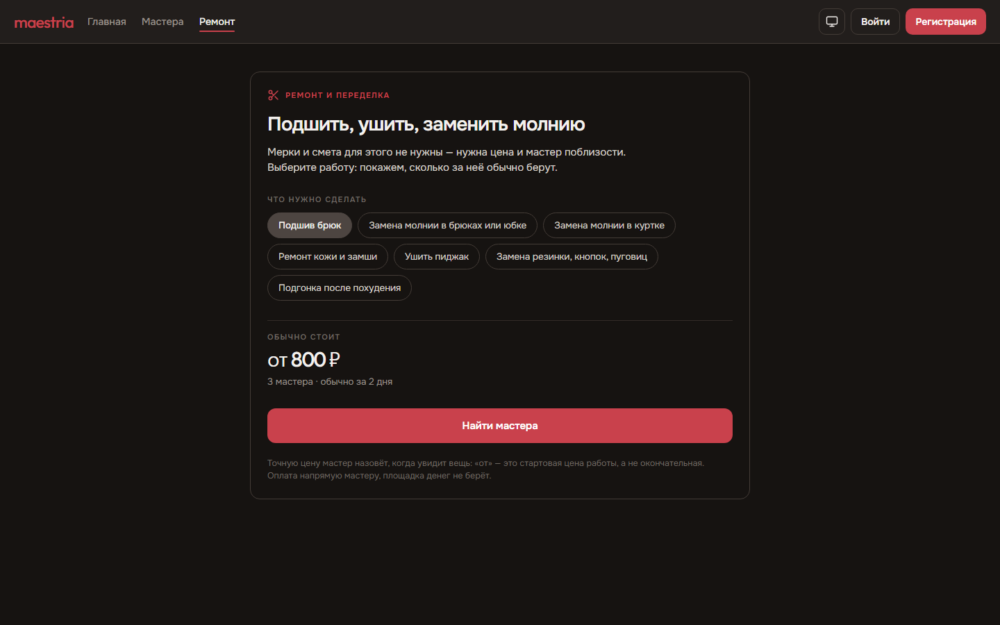

# Maestria — Custom Tailoring Marketplace

A two-sided marketplace that connects customers with tailors, seamstresses and
designers for made-to-measure clothing and alterations.

**Live product: [maestriaclub.ru](https://maestriaclub.ru)**

*Walkthrough of the public site: home, master catalogue, a master's page and the
repair price flow.*

> Team project, actively developed. The source code lives in a private team
> repository; this repo documents the product and my contribution to it.

## The problem

Buying off-the-rack means fitting yourself to a size chart. Getting something made
to measure means finding a tailor through word of mouth, with no portfolio, no clear
price, and no guarantees on timing.

Tailors have the mirror problem: clients arrive through social media with vague
requests, and every order starts with the same manual back-and-forth about
measurements, price and deadlines.

Maestria puts both sides in one place: verified portfolios, an itemised quote agreed
before work starts, and the whole order — measurements, fittings, chat, progress
photos — tracked in one thread.

## Users

- **Customers** who need made-to-measure clothing or alterations
- **Tailors and seamstresses** looking for a steady flow of well-specified orders

## What is shipped

The product is live with real master profiles and a working order pipeline.

**Marketplace**
- Master catalogue with filters (city, garment type, audience, price) and map view
- Master pages: portfolio feed, services, price range, reviews with master replies
- Favourites, star ratings, "profile verified" badge, availability status
- Repair & alterations price list — order a fixed-price job in one tap

A master's page — portfolio, terms, repair price list and reviews with replies:

**Order pipeline**
- Request → quote → agreement → in progress → fitting → done, with archive
- Itemised quotes; changing the price after agreement resets approval automatically
- Fitting invitations, rescheduling by either side, day-before reminders
- Work stages with progress photos, so the customer sees movement instead of silence
- One request to several masters at once, then compare quotes and pick one
- Draft autosave and recovery, repeat orders, "My items" history with photos

**Communication & trust**
- In-order chat with attachments, quotes, edits, reactions and read receipts
- Support channel between every user and the platform
- Complaints with a moderation workflow and database-level notifications
- Customer measurements shared with a master only while a live order exists

**Platform**
- Auth, roles (client / master) and role switching, guarded by Postgres RLS
- Push notifications, dark theme following the system setting
- Responsive web build alongside native iOS/Android
- SEO-prerendered public pages: metadata, Schema.org, sitemap, city landing pages
- CI/CD to a VPS via GitHub Actions with versioned releases and rollback

## Roadmap

- Payments and escrow (deal protection)
- Database migration to Russian hosting for 152-FZ compliance
- Master verification tiers
- AI generator that turns a photo reference into a written spec
- In-stock fabric catalogue
- Measurements from photos

## Tech stack

| Layer | Technology |
|---|---|
| Mobile & web | Expo SDK 56, React Native 0.85, React 19, TypeScript |
| Navigation | Expo Router (file-based) |
| Backend | Supabase — PostgreSQL, Row Level Security, Edge Functions, Storage |
| UI | react-native-reanimated, react-native-svg, lucide-react-native |
| Web | react-native-web, static export with SEO prerender |
| Delivery | GitHub Actions → VPS (nginx), previously Vercel |

## My role — lead developer & product

I am the main contributor to the codebase: **~530 of 633 commits**, and I review and
merge the team's pull requests.

- Built most of the product end to end: catalogue, order pipeline, chat, reviews,
  moderation, support, measurements, dark theme and the responsive web layout
- Designed the data model and RLS policies in Supabase, including database triggers
  for notifications and quote-approval resets
- Owned the product side: problem framing, user flows, MVP scope and prioritisation,
  competitive analysis, and the metrics the marketplace is judged by
- Set up the public web presence: static export, SEO prerendering, city landing
  pages, and the CI/CD pipeline to the production server

Development was assisted by AI coding tools, with architecture, review and product
decisions my own.
